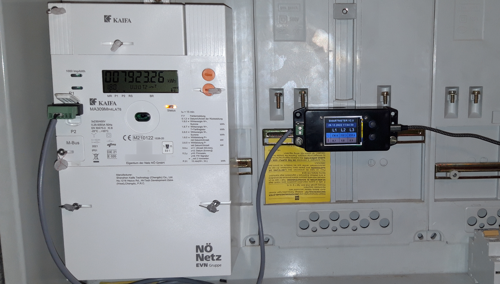
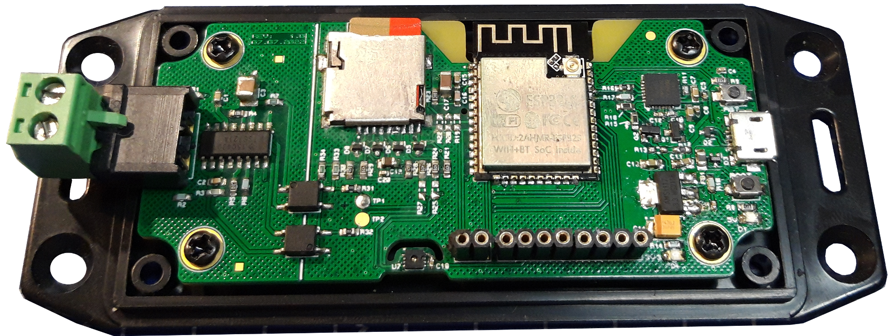

# ESP32 Smartmeter Logger für P1 Kundenschnittstelle

Musste mich gegen ein DIN-Hutschienengehäuse entscheiden, da in meinem Schaltschrank kein Platz mehr war...

## Quellen
 - DLMS Entschlüsselung: [esphome-dlms-meter](https://github.com/DomiStyle/esphome-dlms-meter)
 - Datenlogger: [ESPLogger](https://github.com/fabianoriccardi/ESPLogger)
 - Fileserver: [esp32-asyncwebserver-fileupload](https://github.com/smford/esp32-asyncwebserver-fileupload-example)
 - weitere siehe [platformio.ini](/platformio.ini)

## Unterstützte Smartmeter
- Kaifa MA309M
- Sagecom T210-D

## Unterstützte (bekannte) Netzbetreiber
- Netz Niederösterreich
- VKW (in Entwicklung, siehe Branch [vkw-test](https://github.com/FKW9/esp-smartmeter-netznoe/tree/vkw-test) und [Issue #10](https://github.com/FKW9/esp-smartmeter-netznoe/issues/10)

## Features
- Lest alle verfügbaren OBIS Daten von der Kundenschnittstelle P1 aus
- Speichert alle Daten auf einer SD-Karte im CSV Format ab
- Daten können über einen Webserver heruntergeladen werden
- Daten können an eine [Graphite-Datenbank](https://graphiteapp.org/) gesendet werden
- On-board [Feuchte und Temperatursensor](https://github.com/epluse/HTE501_i2c_arduino)
- TFT Display auf dem aktuelle Werte zu sehen sind, welches sich automatisch nach 2 Minuten inaktivität ausschaltet.
- [WiFi Manager](https://github.com/tzapu/WiFiManager) zum bequemen Aufsetzen

## Allgemeines
Zunächst muss der Entschlüsselungscode angefordert werden. Für Niederösterreich E-Mail an: [smartmeter@netz-noe.at](mailto:smartmeter@netz-noe.at)

Information zur Kundenschnittstelle (netz-nö) sind hier zu finden: [www.netz-noe.at/SmartMeter_Kundenschnittstelle_lektoriert.aspx](https://www.netz-noe.at/Download-(1)/Smart-Meter/218_9_SmartMeter_Kundenschnittstelle_lektoriert_14.aspx).
## Bekannte Probleme
Leistungsfaktor ist teils unglaubwürdig, siehe dazu [Issue #7](https://github.com/FKW9/esp-smartmeter-netznoe/issues/7)

## Software Installation
Das Projekt wurde in PlatformIO entwickelt. Um es zu kompilieren, bitte Einstellungen in [**```platformio.ini```**](platformio.ini) übernehmen.

[**```key.h```**](key.h):
- ```KEY[]```: Hier **muss** der Entschlüsselungs-Code eingetragen werden

[**```config.h```**](config.h):
- ```SD_CARD_LOGGING```: Speichern auf SD-Karte bzw. den Fileserver (de)aktivieren
- ```USE_GRAPHITE```: Daten an Graphite senden (de)aktivieren

### TFT Display Setup
siehe [**```lib/display/README.md```**](lib/display/README.md)

### Optionale Einstellungen
[**```lib/fileserver/fileserver.h```**](lib/fileserver/fileserver.h):
- ```default_httppassword = "admin"```: Fileserver Login Username
- ```default_httppassword = "smartmeter"```: Fileserver Login Passwort

### Test Setup
In [platformio.ini](/platformio.ini) kann das Flag ```TEST_SETUP``` verwendet werden, um ohne Smartmeter die Funktionalität zu überprüfen. Dazu muss **mein** Schlüssel in [key.h](/key.h) verwendet werden.


## Flowchart


## Hardware
Für eine simplere Hardware Version siehe [Release V0.1](https://github.com/FKW9/esp-smartmeter-netznoe/tree/V0.1).

Als Folge meiner ersten Version wurde hier eine eigene PCB mit mehr Features entworfen.
Diese beinhaltet folgende Kern-Komponenten:
- ESP32-S Modul (mit IPEX Konnektor für Antenne, falls schlechter Empfang)
- CP2102 USB-UART Konverter
- Micro SD-Karten Slot
- 1,77 Zoll TFT Display (160x128px)
- TSS721ADR M-Bus zu UART Konverter (Spende vom [M-Bus Slave Click](https://www.mikroe.com/m-bus-slave-click) Board😉)
- Zweipolige Steckklemme für M-Bus Anschluss (TODO: besser wäre direkt eine RJ12 Buchse!)
- Micro USB für Versorgung bzw. Debugging
- Zwei Taster für die Menüführung

Schaltplan, BOM, Anmerkungen, Zukünftige Verbesserungen der PCB usw. befinden sich im Ordner [hardware](/hardware/).

Für einen "simplen" Aufbau wird folgendes benötigt:
- [M-Bus Slave Click](https://www.mikroe.com/m-bus-slave-click) Board (oder Kompatible)
- ESP32 Development Board, vorzugsweise mit SD-Karten Slot
- RJ12 Kabel bzw. (optional) RJ12 Adapter ([Amazon](https://www.amazon.de/ASHATA-Schraubklemmen-Terminalblock-Schraubanschluss-Konverter-default/dp/B07N3WY7R5/ref=sr_1_3?keywords=rj12+adapter&qid=1671988011&sr=8-3), [AliExpress](https://de.aliexpress.com/item/32870211601.html?spm=a2g0o.order_list.order_list_main.5.262c5c5fe1O7zK&gatewayAdapt=glo2deu)) (Anmerkung: Die Gummiisolierung muss etwas getrimmt werden, damit er passt)
- *(optional)* Micro SD-Karten Modul
- *(optional)* 1,77 Zoll TFT Display ([Amazon](https://www.amazon.de/AZDelivery-TFT-Display-128x160-Pixeln-gratis/dp/B078JBBPXK/ref=sr_1_3?__mk_de_DE=%C3%85M%C3%85%C5%BD%C3%95%C3%91&crid=1KY5URTL2K8AB&keywords=1.77%2Bzoll%2Btft&qid=1671988555&sprefix=1.77%2Bzoll%2Btf%2Caps%2C107&sr=8-3&th=1), [AliExpress](https://de.aliexpress.com/item/32812455774.html?spm=a2g0o.productlist.main.1.5d7a6bcbWtKllO&algo_pvid=7de4f81e-7039-4333-ae0b-c152a987c8f3&algo_exp_id=7de4f81e-7039-4333-ae0b-c152a987c8f3-0&pdp_ext_f=%7B%22sku_id%22%3A%2210000000057049428%22%7D&pdp_npi=2%40dis%21EUR%212.31%212.31%21%21%21%21%21%40211be17616719885780517731d0714%2110000000057049428%21sea&curPageLogUid=FEMSJ54pcOO7)) (Anmerkung: Ist derzeit noch voll im Programm integriert und kann nicht einfach "auskommentiert" werden)

### Verbindungen zwischen ESP und M-Bus:
| ESP32-S Modul |        | M-Bus Slave Board | RJ12 | Anmerkung                                            |
|-------|--------|-------------------|------|------------------------------------------------------|
| 3.3V  |        | 3V3               |      | Versorgung                                           |
| GND   |        | GND               |      | Masse                                                |
| RXD 2 | GPIO16 | TX                |      | Empfangene Daten vom M-Bus                           |
| TXD 2 | GPIO17 | RX                |      | Optional, da wir keine Daten senden |
|       |        | MBUS1             | 3    | M-Bus Ausgang, Polarität egal                        |
|       |        | MBUS2             | 4    | M-Bus Ausgang, Polarität egal                        |

### Verbindungen zwischen ESP und TFT Display:
| ESP32-S Modul |   | TFT Display | Anmerkung                               |
|-------|--------|-------------|-----------------------------------------|
| 3.3V  |        | VCC         | Versorgung                              |
| GND   |        | GND         | Masse                                   |
| SCK   | GPIO18 | SCK         |                                         |
| MOSI  | GPIO23 | SDA         |                                         |
| MISO  | GPIO19 | RES         |                                         |
|       | GPIO25 | RS          |                                         |
| SS    | GPIO5  | CS          |                                         |
|       | GPIO26 | LEDA        | Display an/aus (Hintergrundbeleuchtung) |

### Verbindungen zwischen ESP und TFT Display:
**Achtung:** Ob ein SPI Micro SD-Karten Modul kompatibel mit dem TFT Display ist, weiß ich nicht. Ich verwende die SD-Karte im 4-Bit SD Bus Mode, welcher folgend aufgelistet ist.
| ESP32-S Modul  | SD-Karte |         | Anmerkung                                                    |
|--------|----------|---------|--------------------------------------------------------------|
| 3.3V   | VDD      |         | Versorgung                                                   |
| GND    | VSS      |         | Masse                                                        |
| GPIO2  | SD_DATA0 | DAT0    |                                                              |
| GPIO4  | SD_DATA1 | DAT1    |                                                              |
| GPIO12 | SD_DATA2 | DAT2    |                                                              |
| GPIO13 | SD_DATA3 | CD/DAT3 |                                                              |
| GPIO15 | SD_CMD   | CMD     |                                                              |
| GPIO14 | SD_CLK   | CLK     |                                                              |
| GPIO27 | SD_CD    | CD      | Card detect. Erkennt, ob SD-Karte physisch vorhanden ist (Schließer). |
---
## Showcase

### **Fileserver**
Für jeden Monat wird eine Datei erstellt. Ein Monat hat ca. 60MB und dauert somit ungefähr 5 Minuten zum Herunterladen.
Als Übersicht wird oben der SD-Karten Status (Freier Speicher, usw.) angezeigt.


### **Visualisierung**
Zur Visualisierung wird Grafana (und Graphite) verwendet. Beide Programme laufen auf einem NAS (Synology DS218).


### **TFT Display**


### **PCB**


## Zukünftiges
Es gibt noch viele Ideen für weitere Entwicklungen, siehe dazu:
- Hardware: [TODO's](/hardware/TODO.md)
- Software: [TODO's](/TODO.md)
